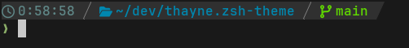

# thayne.zsh-theme
A simple zsh theme that just does what I want

## Why I made this

I used [powerlevel10k](https://github.com/romkatv/powerlevel10k) for a while, and I think that it is a great project.
However, I came to the conclusion that it was too complicated for what
I needed, and making my own theme would work better for me personally.

The specific issues I had with powerlevel10k are as follows:

- It includes a ton of features that I don't use
- Because it does so much, the code is difficult to understand without spending a lot of time studying it
- Editing the configuration file is pretty difficult. The configuration generated by the interactive wizard is huge,
  and while it is possible to trim it down, getting what I wanted was still a considerable amount of code.
- Although there is a lot of configurability, it isn't well documented. You have to rely on documentation for powerlevel9k,
  and the limited comments in the generated configuration file.
- It requires compiling a c program for git status, which itself links to a patched version of libgit2 that needs to be compiled
- It uses an unusual directory structure, which makes it difficult to install as a system package

So, much as I appreciate the work done by romkatv, I realized that I could create my own prompt that did everything I needed without having to depend on
a massive project like powerlevel10k.
